# tbill — 시세·차트·정량 전략 분석 & 매매일지

국내주식·미국주식·암호화폐의 시세와 차트를 한 화면에서 보고, **기본적·기술적·시장 국면 지표를 0~100 점수로 수치화한 전략 분석**과 **백테스트**로 매매 판단을 돕는 서비스. 점수가 **어떤 지표·밴드·가중치로 나왔는지 모두 보여 주고**, 사용자가 그 분석 방법을 직접 고쳐 **내 전략**으로 저장·검증할 수 있다. **시장 동향**(섹터 로테이션·규칙 기반 브리핑)과 전략·매매일지를 나누는 **커뮤니티**도 있다. 최종 목표는 신호 제공 → 모의투자 → 소액 자동매매로의 확장이다.

| 대상 시장 | 데이터 소스 (전부 무료) | 갱신 |
|---|---|---|
| 국내주식 (KOSPI·KOSDAQ) | FinanceDataReader, pykrx, 네이버 금융 | 장중 20초~1분 |
| 미국주식 (NYSE·NASDAQ) | yfinance, NASDAQ Trader | 장중 20초~1분 (일부 지연 시세) |
| 암호화폐 (Upbit KRW 마켓) | Upbit 공개 REST·WebSocket | **실시간** (1초) |

> 본 서비스의 분석 결과는 투자 참고용이며 투자 판단과 책임은 이용자에게 있다.

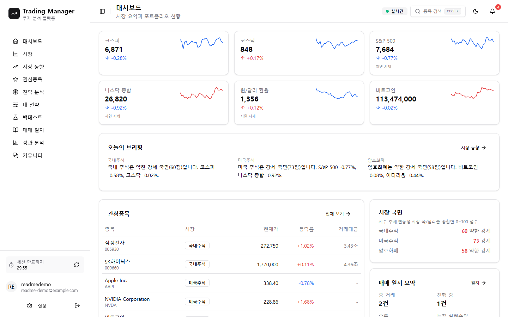

---

## 포트폴리오 요약

> **개인 프로젝트 · 2025.11 ~ 2026.09 · 기획·백엔드·데이터·프론트 전 영역**
>
> 무료 데이터만으로 국내·미국 주식과 코인의 시세·차트를 제공하고, 정량 전략 점수를 **계산 근거까지 보여 주며**, 사용자가 분석 방법을 직접 만들어 백테스트로 검증하고 커뮤니티에 공유하는 서비스.

| 설명 가능한 분석 | 내 전략 vs 기본 모델 백테스트 | 섹터 로테이션 |
|---|---|---|
| 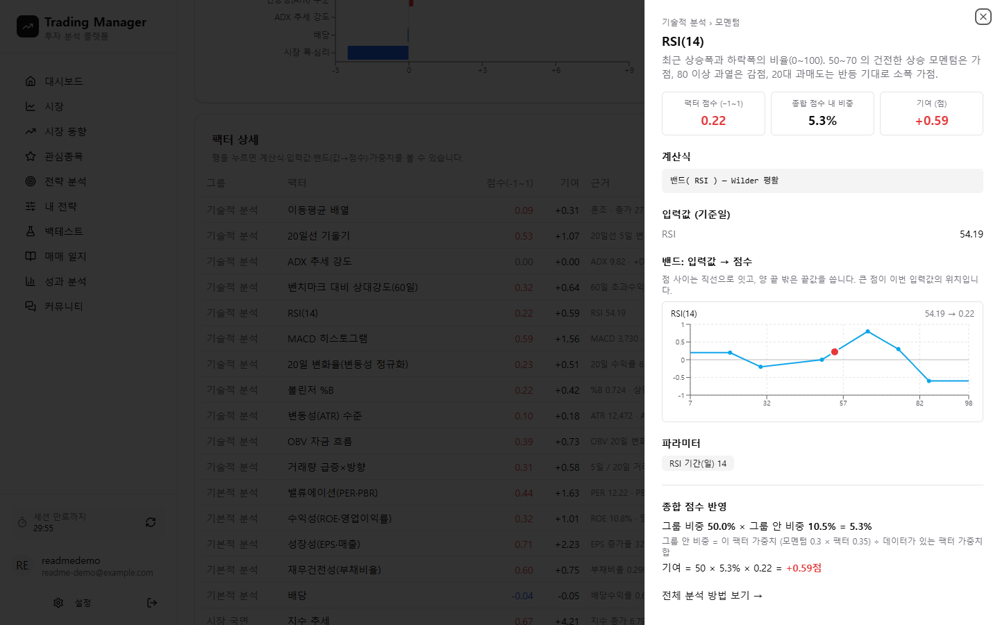 | 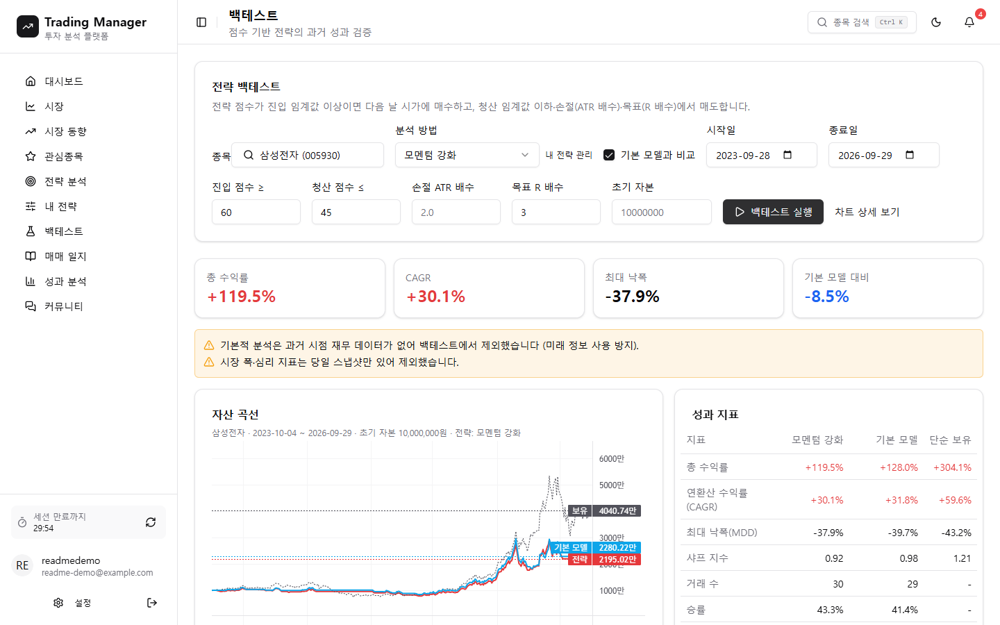 | 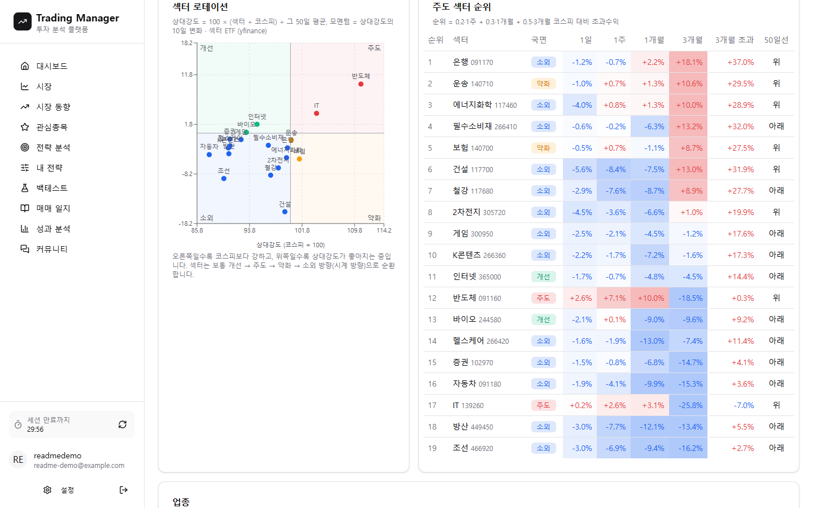 |

### 기술 스택

| 영역 | 사용 기술 |
|---|---|
| 백엔드 (공개 API) | Java 21, Spring Boot 3.3 (Web · Security · Data JPA · Kafka · Data Redis · Validation), JWT, SSE |
| 데이터 저장·메시징 | PostgreSQL 15, Redis (캐시 · 분석 결과 · pub/sub · 리프레시 토큰), Apache Kafka |
| 시세·분석 서비스 | Python 3.14, FastAPI, pandas/numpy, confluent-kafka, Upbit WebSocket |
| 프론트엔드 | React 19, TypeScript, Vite, Redux Toolkit (RTK Query), shadcn/ui, lightweight-charts, recharts |
| 테스트·운영 | JUnit5 · Mockito · `@DataJpaTest`(H2) · MockRestServiceServer, pytest · fakeredis · respx, vitest, Playwright, Docker Compose, Kubernetes 매니페스트 |

### 아키텍처

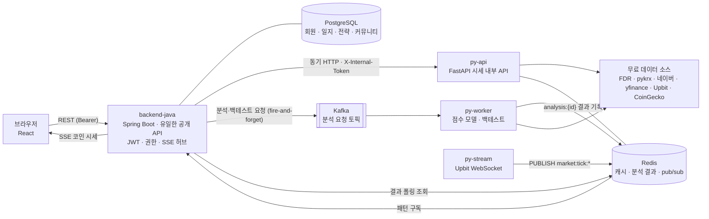
```mermaid
flowchart LR
    B["브라우저<br/>React"]
    J["backend-java<br/>Spring Boot · 유일한 공개 API<br/>JWT · 권한 · SSE 허브"]
    PG[("PostgreSQL<br/>회원 · 일지 · 전략 · 커뮤니티")]
    PA["py-api<br/>FastAPI 시세 내부 API"]
    K[["Kafka<br/>분석 요청 토픽"]]
    W["py-worker<br/>점수 모델 · 백테스트"]
    S["py-stream<br/>Upbit WebSocket"]
    R[("Redis<br/>캐시 · 분석 결과 · pub/sub")]
    EXT["무료 데이터 소스<br/>FDR · pykrx · 네이버 · yfinance · Upbit · CoinGecko"]

    B -->|"REST (Bearer)"| J
    J -->|"SSE 코인 시세"| B
    J --- PG
    J -->|"동기 HTTP · X-Internal-Token"| PA
    J -->|"분석·백테스트 요청 (fire-and-forget)"| K
    K --> W
    W -->|"analysis:{id} 결과 기록"| R
    J -->|"결과 폴링 조회"| R
    S -->|"PUBLISH market:tick:*"| R
    R -->|"패턴 구독"| J
    PA --> EXT
    W --> EXT
    PA --- R
```

상세한 데이터 흐름은 [구성](#구성) 절에 있다.

### 백엔드 설계 포인트

| 주제 | 내용 |
|---|---|
| 비동기 분석 파이프라인 | 분석·백테스트는 HTTP 로 기다리지 않는다. Java 가 `requestId` 를 발급해 Kafka 에 넣고 바로 201 을 돌려주면, worker 가 Redis `analysis:{id}` 에 `RUNNING → SUCCESS/FAILED` 를 기록하고 프론트가 폴링한다. 파싱할 수 없는 요청도 반드시 `FAILED` 를 남겨 무한 대기가 없다. ([AnalysisController](backend-java/src/main/java/io/tbill/backendapi/presentation/analysis/controller/AnalysisController.java), [handler.py](backend-python/app/worker/handler.py)) |
| 공개 API 는 Java 하나 | 인증·권한·소유권 검사를 한곳에서 한다. Python 은 내부 토큰으로만 호출되고 상태가 없다. 사용자 전략은 Java 가 `presetId` 를 소유권 확인 후 설정 JSON 으로 풀어 Kafka 파라미터에 싣는다. |
| 도메인별 3계층 | `presentation / domain / infrastructure` 를 9개 도메인(일지·전략·시세·관심종목·커뮤니티·소셜 등)에 반복한다. 모든 조회는 이메일로 소유 범위를 좁히고, 커뮤니티 응답은 이메일 대신 username 만 내보낸다. ([AuthorDirectory](backend-java/src/main/java/io/tbill/backendapi/domain/content/service/AuthorDirectory.java)) |
| 캐시와 장애 격리 | 시세 캐시는 Redis 한곳(single-flight 락, 봉 주기·장 운영 시간별 TTL). 비공식 무료 소스는 공급자 폴백 체인 + 호출 간격 제한 + 서킷브레이커(60초 5회 실패 시 5분 차단)로 감싼다. ([cache.py](backend-python/app/core/cache.py), [providers/base.py](backend-python/app/market/providers/base.py)) |
| 실시간 시세 | Upbit 전 종목을 WebSocket 하나로 받아 초당 1건으로 합친 뒤 Redis pub/sub → Java `SseEmitter` 허브로 중계한다. 브라우저는 탭당 연결 1개, 끊긴 연결은 오류 로그 없이 정리한다. ([MarketStreamService](backend-java/src/main/java/io/tbill/backendapi/domain/market/service/MarketStreamService.java)) |
| 이벤트 기반 알림·보안 | 댓글·좋아요·팔로우 알림은 `@TransactionalEventListener`(커밋 후) + `REQUIRES_NEW` 로 저장해 본 작업과 격리한다. 사용자 HTML 은 서버 jsoup 과 화면 DOMPurify 로 이중 정화하고, 관리자 API 는 `@PreAuthorize("hasRole('ADMIN')")` 로 막는다. ([NotificationService](backend-java/src/main/java/io/tbill/backendapi/domain/social/service/NotificationService.java), [HtmlSanitizer](backend-java/src/main/java/io/tbill/backendapi/global/utils/HtmlSanitizer.java)) |

### 문제 해결 사례

| 문제 | 원인 | 해결 | 결과 |
|---|---|---|---|
| Java → Python POST 요청의 본문이 비어서 도착 | JDK `HttpClient` 기본값(HTTP/2)이 평문 연결에서 h2c 업그레이드 헤더를 보내고, uvicorn 이 업그레이드 요청의 본문을 버림 (소켓으로 재현: 응답 282B → 94B) | 내부 호출 클라이언트를 HTTP/1.1 로 고정 ([PythonClientConfig](backend-java/src/main/java/io/tbill/backendapi/infrastructure/client/python/PythonClientConfig.java)) | 전략 설정 검증 API 정상화, 오류 전달 회귀 테스트 추가 |
| 인증·권한 실패가 500 으로 응답 | `@RestControllerAdvice` 가 Spring Security `ExceptionTranslationFilter` 보다 먼저 예외를 잡아 범용 핸들러로 떨어짐 | `AuthenticationException`→401, `AccessDeniedException`→403, 깨진 요청 본문→400 핸들러 추가 ([GlobalExceptionHandler](backend-java/src/main/java/io/tbill/backendapi/global/exception/GlobalExceptionHandler.java)) | 일반 사용자의 관리자 API 호출이 403 으로 응답 (E2E 확인) |
| 새 게시판 카테고리 저장 시 제약 위반 | Hibernate 6 가 enum 컬럼에 만든 CHECK 제약을 `ddl-auto: update` 가 갱신하지 않음 | 제약을 다시 만드는 수동 마이그레이션 작성 ([V5__community.sql](backend-java/src/main/resources/db/manual/V5__community.sql)), 운영 스키마 절차 문서화 | 로컬·운영 스키마 차이 제거 |
| 매매일지·게시글의 저장형 XSS | 에디터 HTML 을 그대로 `dangerouslySetInnerHTML` 로 렌더링 | 저장 시 jsoup Safelist 정화 + 렌더링 시 DOMPurify, 사용자 HTML 은 [SafeHtml](frontend/src/components/common/SafeHtml.tsx) 한 곳에서만 렌더링 | `<script>`·`onerror` 페이로드가 저장·실행되지 않음 (단위 테스트 + 브라우저 E2E) |
| 분석 모델을 설정 기반으로 바꾸면서 점수 회귀 위험 | 하드코딩된 가중치·구간을 사용자 설정(가중치·기간·밴드·임계값)으로 분리하는 대규모 리팩터링 | 리팩터 전 출력을 골든 값으로 저장해 비교, 임의 설정에서 `50 + Σ기여도 = 점수` 불변식 검사 ([test_strategy_config.py](backend-python/tests/test_strategy_config.py)) | 12개 케이스 불일치 0, 임의 설정 24개에서 불변식 성립 |
| 성과순 정렬에서 성과 없는 글이 맨 앞 | Spring Data 의 Criteria 정렬이 `Sort.Order.nullsLast()` 를 무시하고, PostgreSQL 은 내림차순에서 NULL 을 앞에 둠 | 성과순 정렬일 때 지표가 있는 행만 조회 ([ContentSpecs](backend-java/src/main/java/io/tbill/backendapi/domain/content/repository/ContentSpecs.java)) | H2 저장소 테스트로 고정 ([ContentRepositoryTest](backend-java/src/test/java/io/tbill/backendapi/domain/content/repository/ContentRepositoryTest.java)) |

### 품질과 검증

- **자동 테스트**: Java 87개 (Mockito 서비스·컨트롤러, `@DataJpaTest` H2 저장소, `MockRestServiceServer` 외부 호출) · Python 120개 (네트워크 없이 fakeredis·respx·저장한 응답 샘플) · 프론트 39개 (vitest)
- **E2E**: 기능 단계마다 실제 서버(Java·Python·Kafka·Redis·PostgreSQL)를 띄우고 Playwright 로 API 와 화면을 끝까지 확인 — 권한(401/403/404), 중복(409), 검증 오류, 알림, 숨김 처리 등
- **문서 자동화**: 아래 기능 설명의 스크린샷은 `npm run docs:screenshots` 한 번으로 데모 데이터를 만들고 다시 캡처한다
- 스스로 찾은 한계와 남은 문제는 [알려진 문제](#알려진-문제)에 그대로 적어 두었다

### 개발 방식

요구사항 정의·설계 결정·검증은 직접 하고, 구현에는 AI 페어 프로그래밍 도구(Claude Code)를 활용했다. 커밋의 공동 작성자 표기가 이를 나타낸다.

---

## 목차

0. [포트폴리오 요약](#포트폴리오-요약)
1. [기능과 사용 방법](#기능과-사용-방법)
2. [로컬 실행](#로컬-실행)
3. [구성](#구성)
4. [전략 점수 모델](#전략-점수-모델)
5. [API](#api)
6. [테스트](#테스트)
7. [알려진 문제](#알려진-문제)
8. [로드맵](#로드맵)
9. [README 스크린샷 갱신](#readme-스크린샷-갱신)

---

## 기능과 사용 방법

### 1. 로그인 · 회원가입

`/register` 에서 닉네임(중복 확인)·이메일·비밀번호로 가입하고 `/login` 에서 로그인한다. 로그인 전에 열었던 주소(예: 종목 상세 딥링크)가 있으면 로그인 후 그 화면으로 돌아간다. 세션은 30분이며 사이드바 하단 타이머의 새로고침 버튼으로 연장한다.

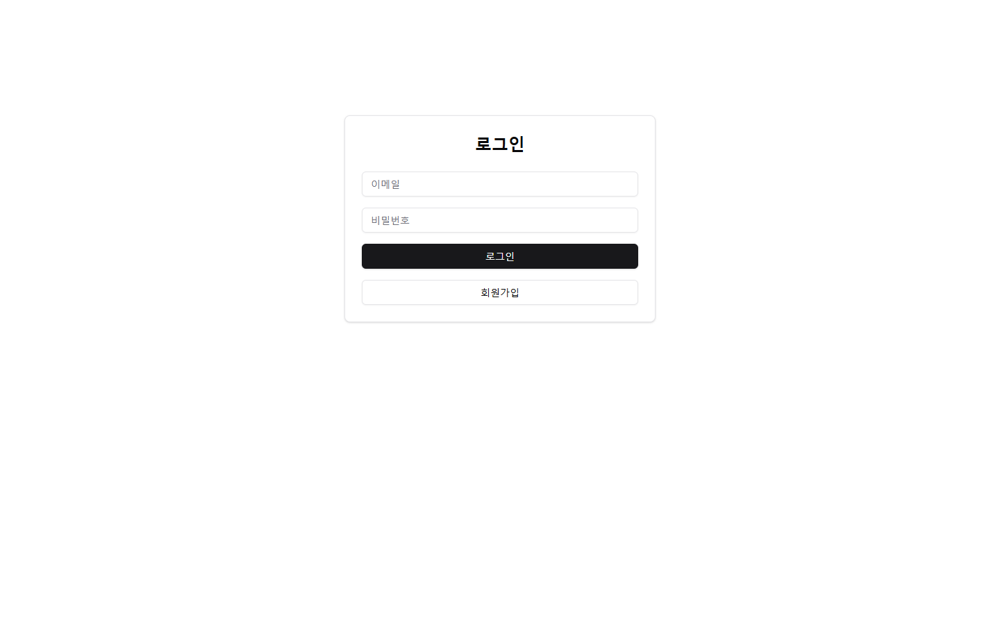

### 2. 대시보드 — `/dashboard`

로그인 직후 보이는 요약 화면.

- **주요 지수**: 코스피·코스닥·S&P 500·나스닥·원/달러·비트코인과 최근 30일 추세선
- **오늘의 브리핑**: 국내·미국·코인 시장의 한 줄 요약. 누르면 [시장 동향](#4-시장-동향--trends)으로 이동
- **관심종목**: 상위 10개. 주식은 장중 주기 갱신, 코인은 실시간. 행을 누르면 종목 상세로 이동
- **시장 국면**: 시장별 0~100 점수 (지수 추세·변동성·시장 폭/심리) — [전략 점수 모델](#전략-점수-모델)의 시장 국면 그룹과 같은 계산
- **매매 일지 요약**: 총 거래·진행 중·승률·누적 실현손익

### 3. 시장 — `/market`

- 상단: 지수 카드 8개(VIX·이더리움 포함), 시장별 개장/마감, 코인 공포·탐욕 지수, BTC 도미넌스
- 하단 탭(국내주식·미국주식·암호화폐): **상승률 / 하락률 / 거래대금(미국은 거래량) 상위 10**. 행을 누르면 종목 상세로 이동

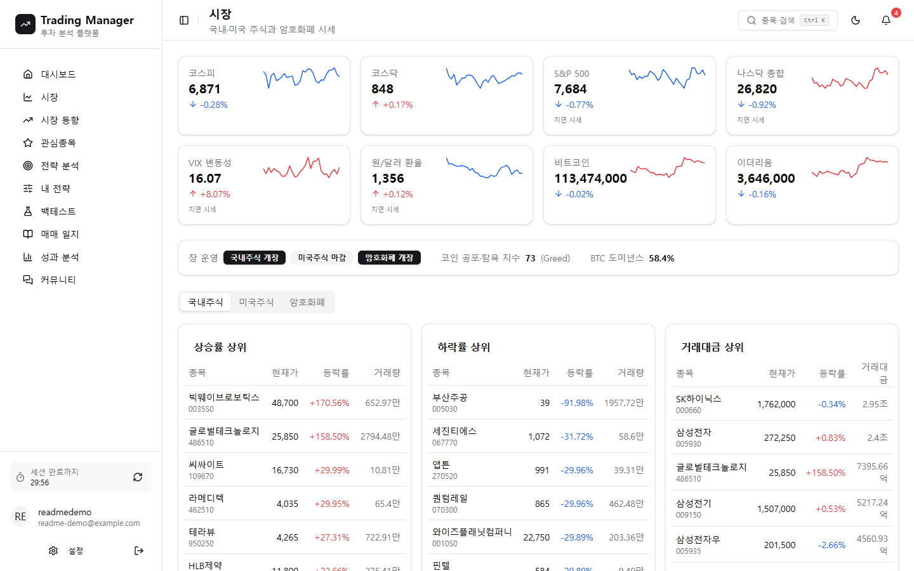

### 4. 시장 동향 — `/trends`

오늘 시장이 어떤지, 어떤 섹터가 시장을 이끄는지 한 화면에서 본다. 상단 탭으로 `국내주식`·`미국주식`·`암호화폐` 를 고른다.

1. **오늘의 브리핑**을 읽는다. 지수와 시장 국면 → 주도 섹터 → 오늘의 흐름(업종·테마·거래대금 상위) → 주의 신호 순서로 정리된다.
2. 문장 끝의 ⓘ 에 마우스를 올리면 그 문장의 **근거 수치**가 보인다.
3. 오른쪽 위 `시장 국면 NN` 버튼을 누르면 국면 점수를 이루는 팩터가 펼쳐지고, 행을 누르면 계산식·입력값·밴드를 볼 수 있다.
4. 날짜 선택에서 지난 브리핑(최근 14일)을 다시 본다.

- 브리핑은 **정해진 규칙으로 수치에서 만든 문장**이다(LLM 을 쓰지 않는다). 같은 입력이면 항상 같은 문장이 나온다.

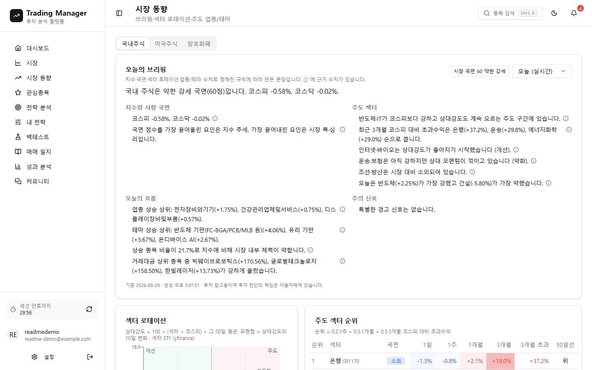

- **섹터 로테이션**: 섹터 ETF(국내 19개·미국 SPDR 11개)의 상대강도를 사분면에 찍는다. 오른쪽일수록 시장(코스피·S&P 500)보다 강하고, 위쪽일수록 상대강도가 좋아지는 중이다. 섹터는 보통 개선 → 주도 → 약화 → 소외 순으로 돈다.
- **주도 섹터 순위**: 1일·1주·1개월·3개월 수익률 히트맵과 3개월 초과수익. 순위 = 0.2·1주 + 0.3·1개월 + 0.5·3개월 초과수익. 미국은 행을 누르면 섹터 시가총액 상위 기업이 나온다.
- **업종·테마**(국내): 네이버 금융의 오늘 업종·테마 등락 상/하위와 상승·하락 종목 수. 행을 누르면 구성 종목이 뜨고, 종목을 누르면 종목 상세로 간다.


- **암호화폐**: 업비트 KRW 상승 종목 비율, 거래대금 상위 10개 쏠림, BTC 도미넌스·공포탐욕지수 30일 추이, CoinGecko 카테고리(글로벌·USD 기준) 강세/약세.
- 국내 업종·테마는 당일 등락만 있어 다기간 추세는 섹터 ETF 로 계산한다. 데이터는 무료 비공식 소스라 지연·누락될 수 있다.

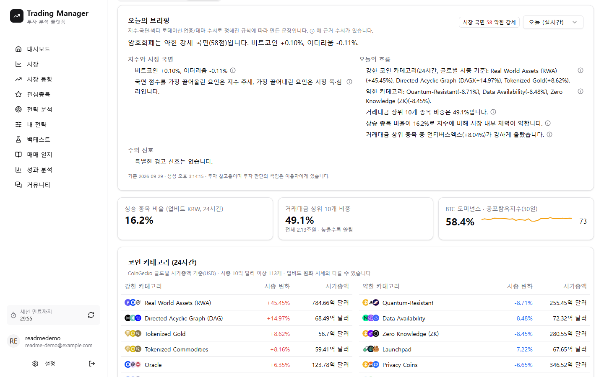

### 5. 종목 검색 — 헤더 `종목 검색` 버튼 또는 `Ctrl + K`

종목명(한글·영문)이나 코드로 검색한다. `삼성`, `AAPL`, `비트`, `btc` 모두 된다. 칩으로 시장을 좁힐 수 있고, 선택하면 종목 상세로 이동한다.

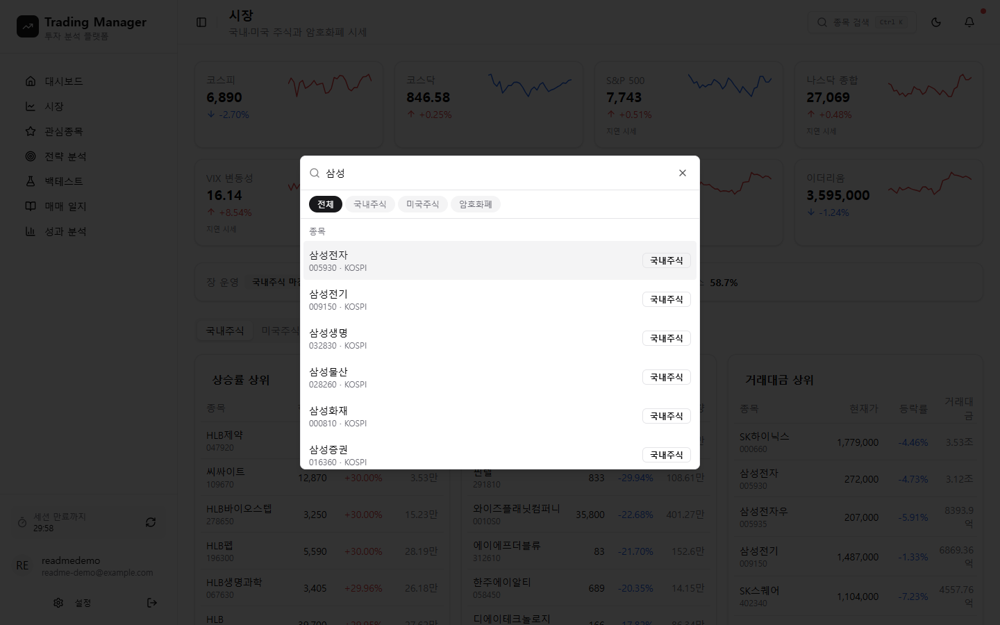

### 6. 종목 상세 — `/market/{kr|us|crypto}/{코드}`

예: `/market/kr/005930`, `/market/us/AAPL`, `/market/crypto/KRW-BTC`. 주소를 그대로 공유·새로고침할 수 있다.

- **시세 헤더**: 현재가·등락, 시가/고가/저가/전일/거래량/거래대금, `지연 시세` 배지(해당 시)
- **관심 추가 ★**: 헤더 오른쪽 버튼으로 관심종목 추가/삭제
- **차트** (TradingView lightweight-charts)
  - 주기 버튼: 국내 `5분~월`, 미국·코인 `1분~월` (국내 분봉은 yfinance 지연 데이터, 최근 60일)
  - `지표` 메뉴: 이동평균 20/60/120, 볼린저 밴드, 거래량, RSI, MACD — 선택은 브라우저에 저장된다
  - 마우스를 올리면 좌상단에 시/고/저/종/거래량 표시, 드래그·휠로 이동·확대
  - 전략 분석 결과의 **진입·손절·목표1·목표2 가격선**이 차트에 그려진다
- **전략 분석 카드**: 페이지를 열면 자동 분석된다. 카드 위 선택기에서 `기본 모델 (v1)` 대신 [내 전략](#8-내-전략--strategies)을 고르면 그 설정으로 다시 분석한다(선택은 전략 분석·백테스트 화면과 공유). 점수·신호·신뢰도와 매매 계획(진입 구간, 손절가, 1.5R/3R 목표, 추적 손절, 권장 비중). `다시 분석` 으로 재계산
- **재무 지표** (주식): PER, PBR, ROE, 영업이익률, 부채비율, 배당수익률, EPS·매출 성장률, 시가총액
- **내 매매기록**: 이 종목의 매매일지가 있으면 표시

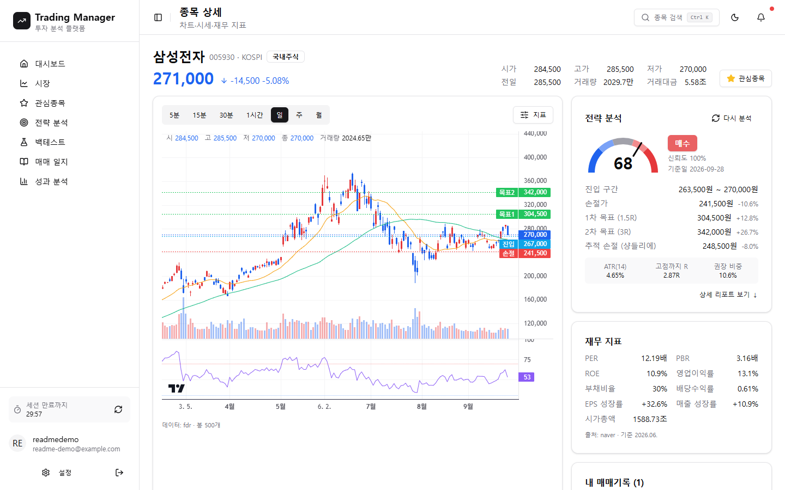

#### 전략 분석 리포트

종목 상세 하단(`상세 리포트 보기 ↓`)에서 점수가 왜 그렇게 나왔는지 확인한다.

- **점수 게이지**: 0 매도 ← 50 중립 → 100 매수. 신호 5단계(강한 매도 ≤25 · 매도 ≤40 · 관망 · 매수 ≥60 · 강한 매수 ≥75)
- **그룹 점수**: 기술적·기본적·시장 국면 각각의 0~100 점수, 실효 비중, 데이터 커버리지. 그룹 이름 옆 ⓘ 에 그룹 설명과 비중 계산법
- **팩터별 기여도**: 50점(중립)에 각 팩터 기여도를 더한 값이 종합 점수. 빨강은 점수를 올린 요인, 파랑은 내린 요인
- **팩터 상세**: 팩터별 점수(-1~1), 기여, 근거(라벨이 붙은 입력값). **행을 누르면 계산 근거 패널**이 열린다
- **경고**: 시장 위험회피 국면, 60일 고점(저항)이 1R 이내, 업비트 투자유의 종목 등
- 오른쪽 위 `분석 방법 보기` 로 전체 계산 방법 페이지(`/analysis/methodology`)로 간다

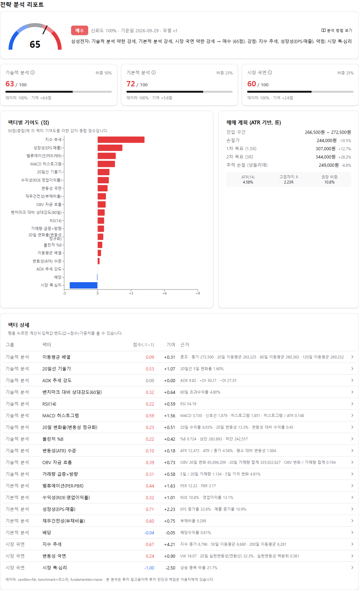

**계산 근거 패널**: 팩터가 무엇을 보는지, 계산식, 기준일 입력값, **밴드(입력값 → 점수) 곡선 위 현재 위치**, 파라미터(기간), 그리고 `그룹 비중 × 그룹 안 비중 = 종합 점수 내 비중`, `기여 = 50 × 비중 × 팩터 점수` 까지 숫자로 보여 준다.


**분석 방법** — `/analysis/methodology`: 점수 계산 5단계(팩터 점수 → 그룹 점수 → 종합 점수 → 기여도 → 신뢰도), 신호·게이트 기준, 시장별 그룹 비중, 팩터 19개 각각의 설명·식·파라미터 범위·기본 밴드 차트, 매매 계획과 백테스트 규칙. 서버의 모델 카탈로그로 그리므로 코드와 항상 같다.

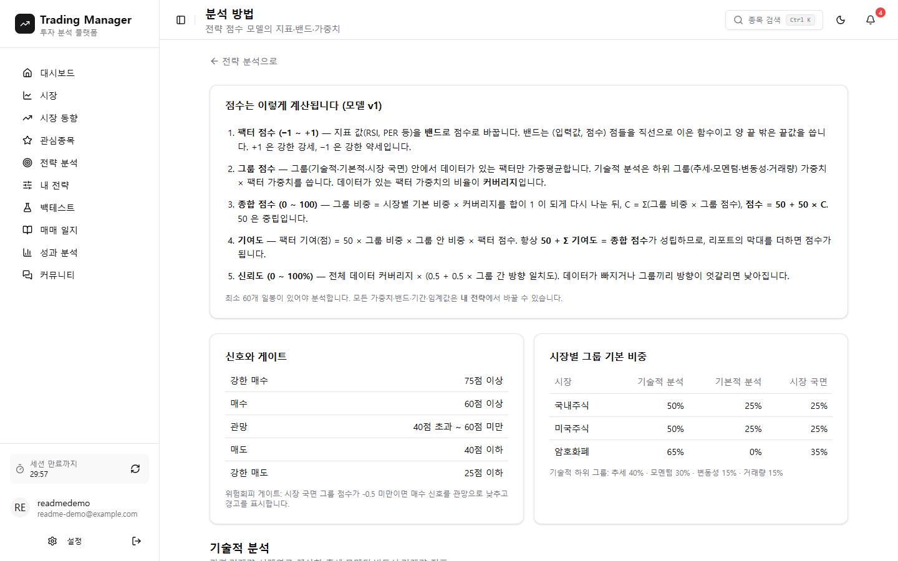

#### 코인 실시간 · 다크 모드

코인 종목은 업비트 체결이 **1초 단위로 가격과 차트의 현재 봉에 반영**된다(헤더에 `● 실시간` 배지). 연결이 끊기면 자동 재연결하고 끊긴 동안의 봉을 다시 받는다. 헤더의 해/달 아이콘으로 라이트·다크 테마를 바꾼다(기본값은 OS 설정).

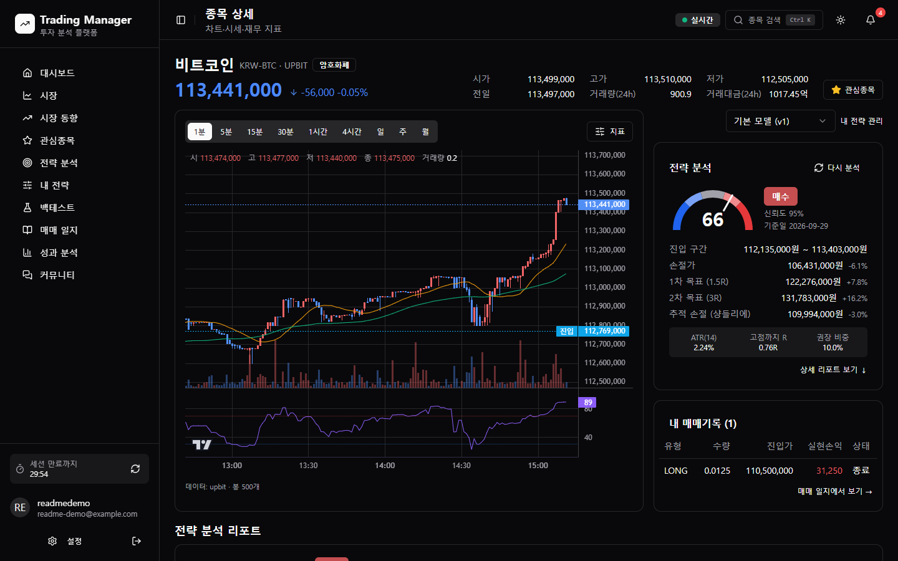

### 7. 전략 분석 — `/analysis`

종목 하나를 골라 옵션과 함께 분석한다.

1. `종목 선택` → 검색 창에서 종목 선택 (주소가 `/analysis?market=us&symbol=AAPL` 처럼 바뀌어 공유 가능)
2. `분석 방법`: `기본 모델 (v1)` 또는 내 전략 (`내 전략 관리` 링크로 편집 화면 이동)
3. (선택) `계좌 금액` 입력 → 계좌 대비 **권장 수량**까지 계산
4. `1회 위험 비율`(0.5% / 1% / 2%) 선택 → 손절 시 계좌 손실이 이 비율이 되도록 비중을 계산
5. `분석 실행`

상단의 **시장 국면 카드**로 국내·미국·코인 시장 전체의 분위기를 먼저 확인할 수 있다. 결과에는 가격선이 그려진 일봉 차트와 전체 리포트가 나오고, 내 전략으로 분석하면 리포트 머리에 `전략 <이름>` 이 표시된다.

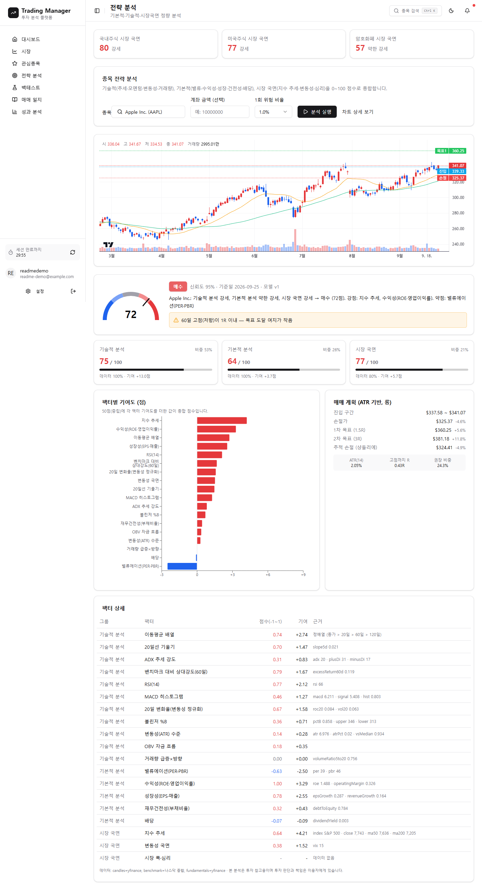

### 8. 내 전략 — `/strategies`

기본 모델을 바탕으로 **나만의 분석 방법**을 만든다. 바꿀 수 있는 것: 팩터 사용 여부, 그룹·하위 그룹·팩터 가중치, 지표 기간(RSI·이동평균·볼린저·ADX 등), **밴드(입력값 → 점수 구간)**, 신호 임계값, 위험회피 게이트, 손절 ATR 배수·목표 R 배수·비중 상한.

1. `새 전략` → 기본 모델 설정으로 전략이 만들어지고 편집 화면이 열린다 (카드의 복제 버튼으로 기존 전략을 복사할 수도 있다, 최대 30개)
2. `팩터` 탭: 스위치로 팩터를 끄고 켜며, 가중치 슬라이더·기간·밴드 점을 고친다. 밴드는 표에서 `입력 x`·`점수` 칸을 고치거나 `+` / `−` 로 점을 추가·삭제한다 (점선은 기본값). `기본값으로` 로 팩터 하나만 되돌린다
3. `그룹 비중` 탭: 시장별 기술적·기본적·시장 국면 비중과 기술적 하위 그룹 비중. 오른쪽 % 가 합 100% 로 나눈 실제 비중이다
4. `신호·리스크` 탭: 매수·매도 임계값, 게이트 사용 여부·기준, 손절·목표 배수, 비중 상한
5. 오른쪽 **미리보기**에서 종목을 고르고 `이 설정으로 분석` → 저장하지 않은 설정 그대로 **기본 모델과 점수·신호를 나란히 비교**하고, 기여도가 크게 달라진 팩터를 보여 준다
6. `저장` (서버가 모델 규칙으로 다시 검증한다. 잘못된 값은 저장 전에 필드 옆과 오른쪽 오류 목록에 표시된다) → `백테스트로 기본 모델과 비교` / `공유`

- 오른쪽 위 배지에 **기본 대비 변경 N곳**과 바꾼 팩터가 표시되고, `바꾼 팩터로 바로 이동` 에서 해당 편집 카드로 간다.
- 과거 데이터에 맞춰 밴드를 세밀하게 조정할수록 과최적화 위험이 커진다. 여러 종목·기간에서 확인할 것.

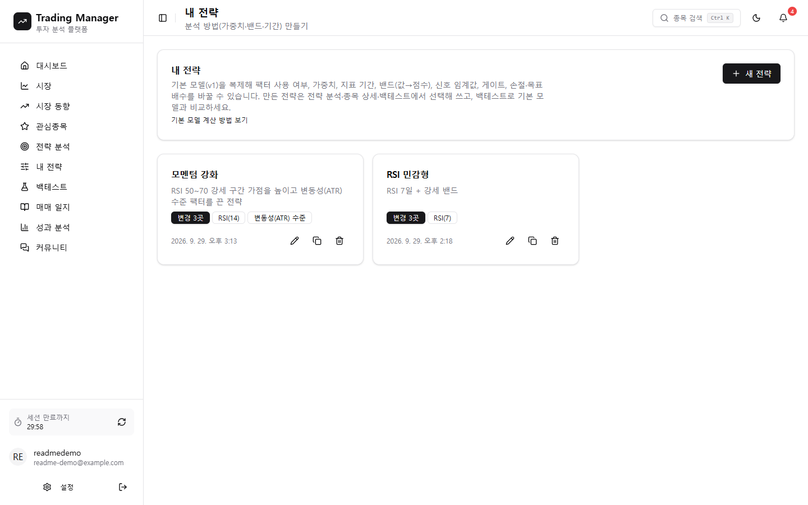

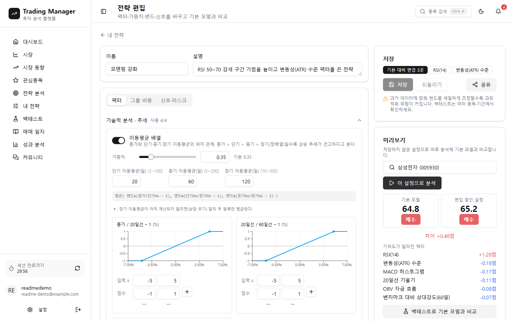

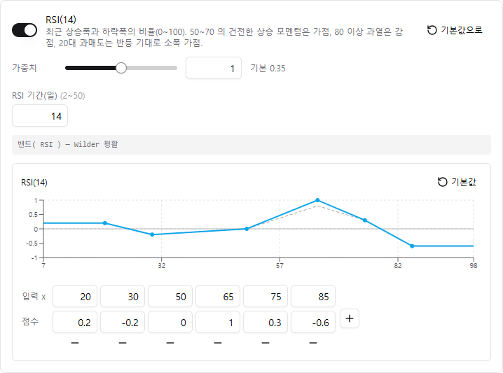

### 9. 백테스트 — `/backtest`

전략 점수로 과거에 매매했다면 어땠는지 검증한다.

1. `종목 선택`, `분석 방법`(기본 모델 또는 내 전략), `시작일`·`종료일` (기본: 최근 3년)
2. 내 전략을 고르면 `기본 모델과 비교` 체크가 나타난다 → 같은 조건으로 기본 모델도 함께 실행한다
3. `진입 점수 ≥`(기본 60) / `청산 점수 ≤`(기본 45): 두 값의 차이가 잦은 매매를 막는다
4. `손절 ATR 배수`(비우면 전략 설정값, 기본 주식 2.0·코인 2.5), `목표 R 배수`(3), `초기 자본`
5. `백테스트 실행` → 수 초 안에 결과

결과 화면:

- 요약: 총 수익률, 연환산 수익률(CAGR), 최대 낙폭(MDD), **단순 보유 대비**(비교 시 **기본 모델 대비**) 초과 수익
- 자산 곡선(전략 vs 보유, 비교 시 기본 모델 곡선 추가)과 낙폭, 성과 지표 비교표(샤프·승률·손익비·평균 보유 기간·노출도 — 비교 시 `내 전략 / 기본 모델 / 단순 보유` 3열)
- 매매 시점 차트(▲매수 ▼청산 사유)와 거래 내역

체결 규칙: 종가 신호 → 다음 날 시가 체결, 같은 날 손절과 목표를 모두 건드리면 손절로 처리(보수적), 수수료·세금·슬리피지 반영. **기본적 분석과 시장 폭·심리 지표는 과거 시점 데이터가 없어 백테스트에서 제외**된다(미래 정보 사용 방지). 과거 성과는 미래 수익을 보장하지 않는다.

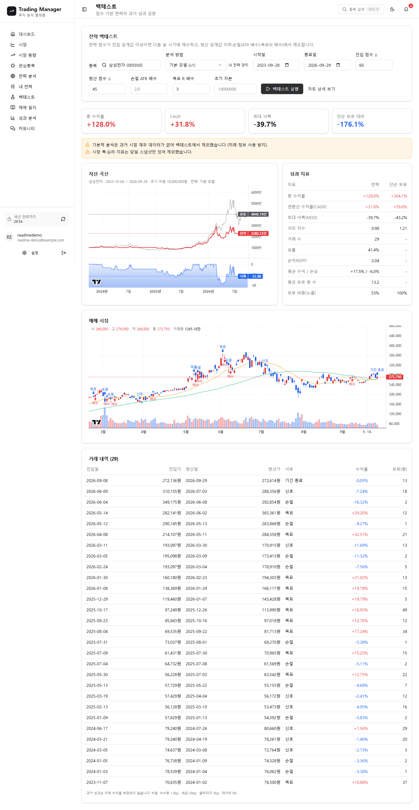


### 10. 관심종목 — `/watchlist`

종목 상세의 `관심 추가 ★` 로 등록한 종목(최대 50개)을 모아 본다. 주식은 장중 20초마다, 코인은 실시간 갱신. 휴지통 버튼으로 삭제, 행을 누르면 종목 상세로 이동.

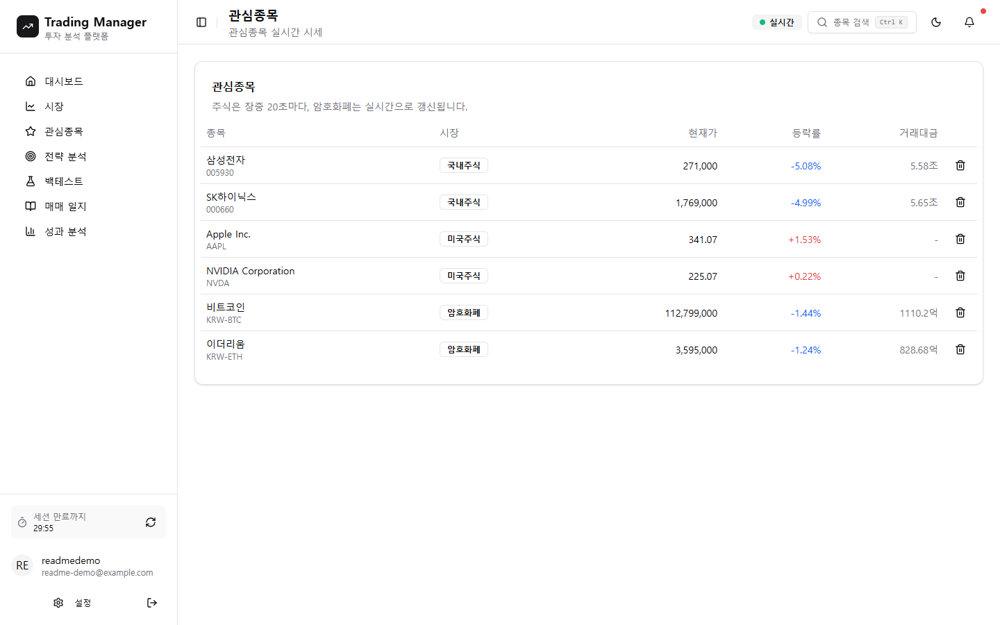

### 11. 매매 일지 — `/journal`

거래를 기록하고 통계를 본다.

- `새 거래 기록`: 종목 코드·시장·거래 유형(Long/Short)·수량·진입가·손절가·실현 손익과 **매매 근거**(서식·이미지를 넣을 수 있는 에디터)를 입력
- 실현 손익을 입력하면 **종료된 거래**로 집계된다(청산가 필드는 아직 없다 — [알려진 문제](#알려진-문제))
- 카드의 종목명을 누르면 해당 종목 상세로 이동한다 (국내주식은 6자리 코드, 코인은 `KRW-BTC` 또는 `BTC` 형태로 입력)
- 상단 필터: 기간·시장·유형·상태
- 카드의 `상세보기` → `커뮤니티에 공유` 로 일지를 [커뮤니티](#12-커뮤니티--community)에 올린다 (아래 참고)

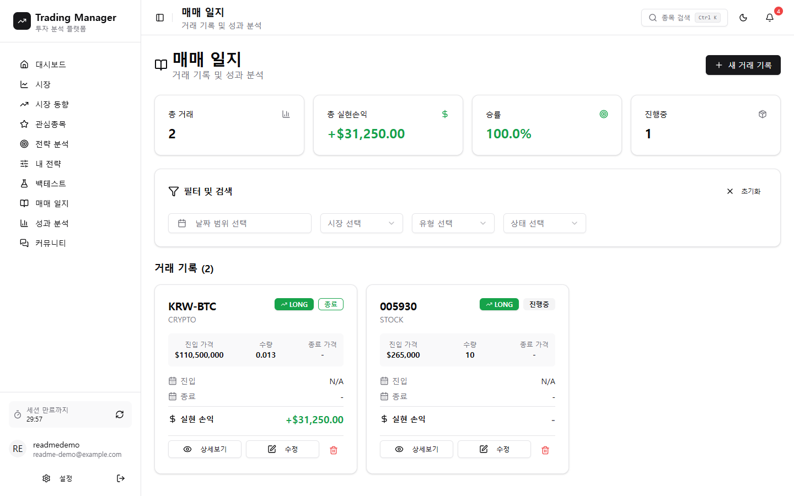

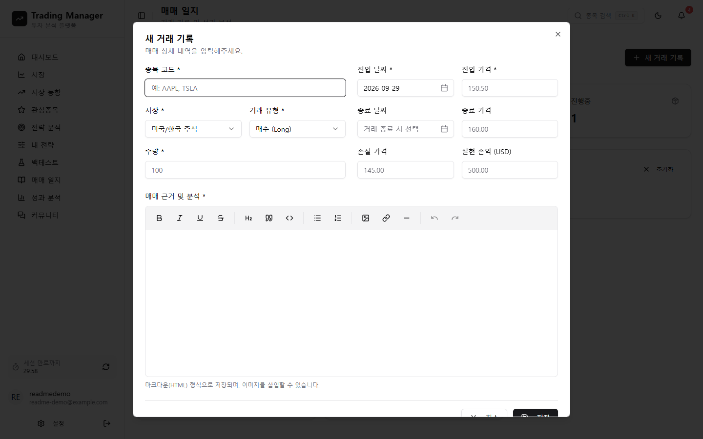

**일지 공유**: 제목·한마디를 적고 `공유`. **`금액 가리기`**(기본 켜짐)를 켜 두면 수량과 실현손익 금액을 서버에서 빼고 **수익률·R 배수**와 진입가·손절가·매매 근거만 공개한다. 공유 시점의 내용을 복사해 올리므로 이후 일지를 고쳐도 게시글은 바뀌지 않는다.

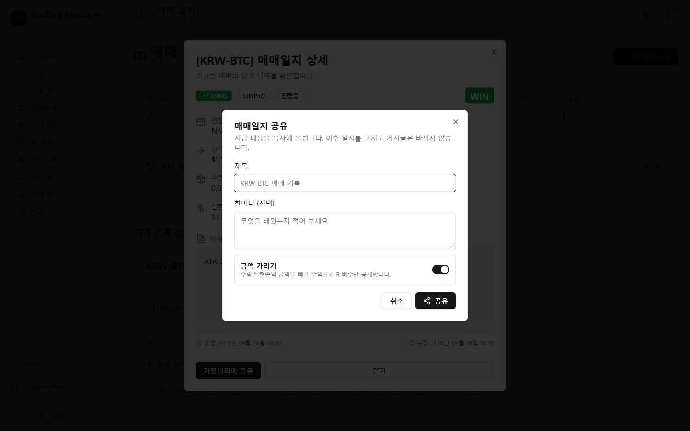

### 12. 커뮤니티 — `/community`

전략과 매매일지를 공유하고 질문·토론한다.

1. 탭으로 게시판을 고른다: `전체`·`전략`·`매매일지`·`자유`·`질문`·`공지`
2. 검색창(제목·본문), 정렬(`최신순`·`좋아요순`·`댓글순`·`조회순`, 전략 탭은 `수익률순`·`낙폭 작은 순`·`가져오기순`), `팔로잉만` 스위치로 좁힌다
3. `글쓰기` → 자유·질문 게시판에 에디터로 글을 쓴다 (공지는 관리자만). 전략·매매일지는 각 화면의 `공유` 로 올린다

- 성과순 정렬은 **백테스트 성과가 첨부된 전략만** 보여 준다.
- 작성자는 닉네임으로만 보이고(이메일은 노출하지 않음), 닉네임을 누르면 프로필로 간다.

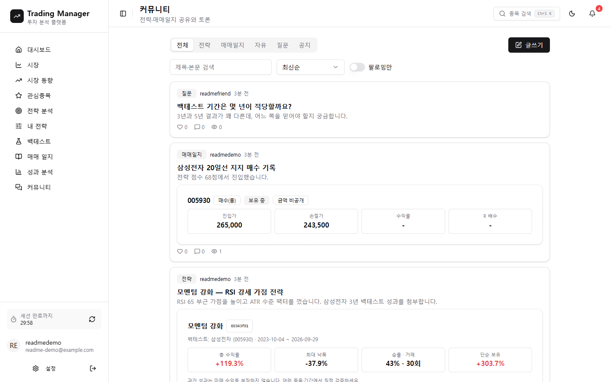

**전략 게시글**: 공유한 전략의 설정과 (첨부했다면) 백테스트 성과 — 총 수익률·최대 낙폭·승률·거래 수·단순 보유 — 그리고 기본 모델 대비 바꾼 곳을 보여 준다.

- `내 전략으로 가져오기` → 설정을 복사한 내 전략이 만들어지고 편집 화면으로 간다 (이름이 겹치면 번호가 붙는다)
- `가져와서 분석해보기` → 가져온 전략을 분석 방법으로 선택하고 백테스트했던 종목으로 전략 분석을 연다
- 성과는 **그 전략(설정 해시가 같은 것)으로 실행한 백테스트만** 첨부할 수 있어 설정과 성과가 어긋나지 않는다. 전략 편집기의 `공유` 에서 최근 24시간 백테스트 중에서 고른다.

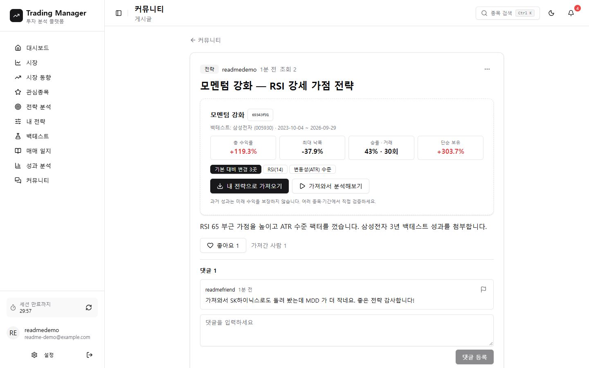

**매매일지 게시글**: 종목·방향·청산 여부, 진입가·손절가, (청산된 거래는) 수익률·R 배수, 매매 근거.

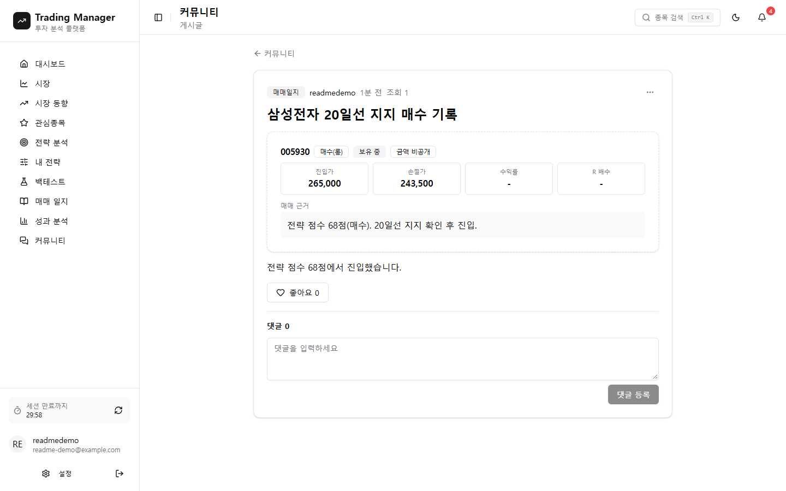

- **좋아요·댓글**: 좋아요는 한 번만 누를 수 있고 다시 누르면 취소된다. 댓글은 본인 것만 수정·삭제한다.
- **신고**: 게시글의 `⋯` → `신고`, 댓글의 깃발 아이콘. 사유(광고·도배, 욕설·비방, 불법·리딩방 유도, 허위 정보, 기타)를 고른다. 같은 대상은 한 번만 신고할 수 있다.
- **프로필·팔로우** — `/users/{닉네임}`: 글·팔로워·팔로잉 수와 작성한 글, `팔로우` 버튼. 팔로우한 사람이 새 글을 쓰면 알림이 오고 `팔로잉만` 필터에 나온다.
- **알림**: 헤더의 종 아이콘(1분마다 갱신). 내 글의 댓글·좋아요, 내 전략 가져가기, 새 팔로워, 팔로우한 사람의 새 글, 내 글 숨김 처리를 알려 준다. 누르면 해당 글로 이동, `모두 읽음` 으로 정리.

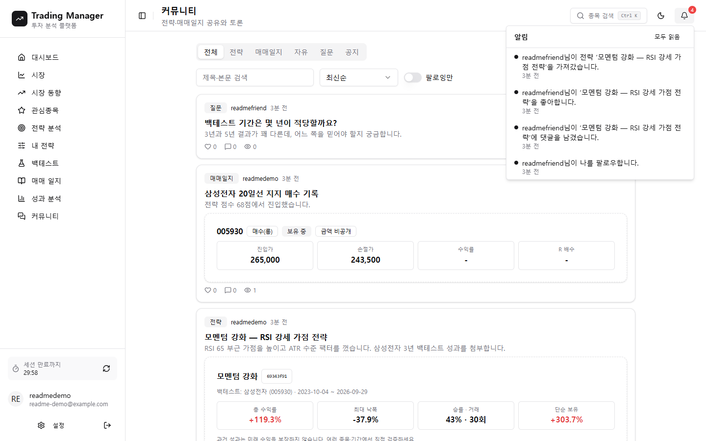

### 13. 신고 관리 (관리자) — `/admin/reports`

관리자 계정에만 사이드바에 `신고 관리` 메뉴가 보인다. `대기`·`숨김 처리`·`기각` 탭으로 신고를 보고, 대기 중인 신고에 `숨김` 또는 `기각` 을 누른다. 숨김 처리하면 같은 대상의 신고가 모두 처리되고, 글은 목록·상세에서 빠지며(작성자에게는 `숨김 처리됨` 으로 보임) 작성자에게 알림이 간다. 게시글 `⋯` 메뉴의 `숨김 (관리자)` 로 신고 없이도 숨기거나 되돌릴 수 있다.

관리자 지정은 DB 에서 한다: `UPDATE users SET role = 'ADMIN' WHERE email = '<이메일>';` (다음 요청부터 반영)

### 14. 성과 분석 — `/performance`

**아직 목업 데이터**(`src/mock/mock-performance-data.ts`)로 표시된다. 매매일지 기반 실데이터 연동은 [로드맵](#로드맵) 항목이다.

---

## 로컬 실행

### 1. 인프라

```bash
docker compose up -d
```

Postgres(:5432), Redis(:6379), Zookeeper(:2181), Kafka(:9092, 컨테이너 내부 `kafka:29092`), Kafka UI(:8989).
다른 프로젝트의 Postgres 가 5432 를 쓰고 있으면 tbill-postgres 포트가 붙지 않아 Java 가 DB 에 접속하지 못한다 — 한쪽만 켤 것.

### 2. Java 백엔드 (:8080)

`backend-java/.env` 에 `JWT_SECRET` 을 넣는다(gitignore 대상. 메인 클래스가 `java-dotenv` 로 읽는다). 어느 프로필에도 기본값이 없다.

```dotenv
# HS512 서명용 — Base64 인코딩된 64바이트 이상
JWT_SECRET=<openssl rand -base64 64 | tr -d '\n' 의 출력>
```

```bash
cd backend-java
./gradlew bootRun          # SPRING_PROFILES_ACTIVE=local 기본
```

나머지(DB·Redis·Kafka·Python API 주소)는 `local` 프로필 기본값이 `docker-compose.yml` 과 맞춰져 있다.
Swagger: http://localhost:8080/swagger-ui/index.html · Health: http://localhost:8080/actuator/health

### 3. Python (시세 API · 분석 worker · 실시간 스트리머)

```bash
cd backend-python
python -m venv .venv
.venv/Scripts/pip install -r requirements-dev.txt        # Linux/macOS: .venv/bin/pip

.venv/Scripts/python -m uvicorn app.api.main:app --port 8000   # 시세 API (필수)
.venv/Scripts/python -m app.worker.main                         # 전략 분석·백테스트 (분석 기능에 필요)
.venv/Scripts/python -m app.stream.main                         # 코인 실시간 (반드시 1개만 실행)
```

Windows 콘솔 로그의 한글이 깨지면 `PYTHONUTF8=1`. Docker 로 한 번에 띄우려면 `docker compose --profile app up -d` (py-api / py-worker / py-stream).

### 4. 프론트엔드 (:5173)

```bash
cd frontend
npm install
npm run dev
```

백엔드 주소가 다르면 `VITE_API_BASE_URL`(예: `http://localhost:8081/api`, `/api` 포함)을 지정한다.

### 무엇이 없으면 무엇이 안 되나

| 꺼져 있는 것 | 증상 |
|---|---|
| Python 시세 API | 시장·차트·검색·재무가 503 (`시세 서비스에 연결할 수 없습니다`) |
| Python worker | 전략 분석·백테스트가 `분석 중…` 에서 90초 뒤 타임아웃 |
| Python 시세 API (전략 저장) | 내 전략 저장·미리보기가 503 (설정 검증을 Python 모델이 한다) |
| Python 스트리머 | 코인 가격이 실시간 대신 5초 폴링으로 갱신 |

### E2E 확인

```powershell
./test_integration.ps1     # Java → Kafka → Python worker → Redis 전략 분석 경로
```

---

## 구성

```
backend-java/    Spring Boot 3.3.1 / Java 21 (io.tbill.backendapi)                  :8080
                 인증(JWT)·영속 데이터(PostgreSQL)·공개 API·SSE 허브
backend-python/  app/ 패키지 하나, 실행 3종
                   app.api     시세 내부 API (FastAPI, Java 만 호출, X-Internal-Token)  :8000
                   app.worker  Kafka 분석 consumer (전략 점수·백테스트)
                   app.stream  Upbit WebSocket → Redis pub/sub (단일 인스턴스)
frontend/        React 19 + TypeScript + Vite + Redux Toolkit(RTK Query) + shadcn/ui   :5173
                 차트: lightweight-charts v5 (시세·자산곡선), recharts (기여도 막대)
infra/           Kubernetes 매니페스트 (Helm/Kustomize 없음)
docs/images/     README 스크린샷 (frontend/scripts/readme-screenshots.mjs 가 생성)
```

### 데이터 흐름

```
[시세·차트]   브라우저 ─REST─▶ Java /api/v1/market/** ─RestClient─▶ Python /internal/v1/**
                                                            └ 공급자 폴백 체인 + Redis 캐시
[코인 실시간] Upbit WS ─▶ app.stream ─PUBLISH market:tick:*─▶ Redis ─▶ Java SSE 허브
                                                            ─▶ 브라우저 EventSource (탭당 1개)
[분석·백테스트] 브라우저 ─POST─▶ Java ─Kafka─▶ app.worker ─▶ Redis analysis:{id}
                브라우저 ◀─폴링 GET /api/v1/analysis/result/{id}── Java
                (내 전략: Java 가 presetId → 설정 JSON 으로 풀어 Kafka 파라미터에 싣는다. Python 은 상태 없음)
[내 전략 저장]  브라우저 ─▶ Java /api/v1/strategies ─▶ Python /internal/v1/analysis/config/validate (정규화·해시)
                                                  └ PostgreSQL strategy_preset
[시장 동향]     브라우저 ─▶ Java /api/v1/market/trends·briefing ─▶ Python (섹터 ETF·네이버 업종/테마·CoinGecko)
                브리핑 스냅샷 Redis briefing:{market}:{date} (30일)
[커뮤니티]      브라우저 ─▶ Java /api/contents·/api/users/*·/api/notifications·/api/admin (PostgreSQL)
                알림은 트랜잭션 커밋 후 이벤트로 저장, 프론트는 안 읽은 수를 1분마다 폴링
```

- **캐시는 Python(Redis)에만** 있다. TTL 은 봉 주기·장 운영 시간에 따라 다르다(1분봉 20초 ~ 장외 일봉 6시간).
- **공급자 폴백**: 국내 일봉 FDR → pykrx → yfinance, 국내 시세·재무 네이버, 미국 yfinance, 코인 Upbit. 공급자별 호출 간격 제한과 서킷브레이커(60초 내 5회 실패 시 5분 차단)가 있다.
- **캔들 시각**: UTC epoch 초. 일봉 이상은 거래소 현지 거래일 00:00 UTC 로 고정한다.
- **종목 키**: `시장:코드` (`KR_STOCK:005930`, `US_STOCK:AAPL`, `CRYPTO:KRW-BTC`), URL 은 `kr|us|crypto`.

언어 간 **수동 동기화가 필요한 계약**:

- Kafka 토픽명 — `KafkaTopics.java` ↔ `app/config.py`
- 분석 결과 스키마(camelCase, `schemaVersion: 3` — 팩터 `explain`·`config` 포함) — `app/analysis/jobs.py`·`backtest.py` ↔ `frontend/src/types/strategy.types.ts`
- 모델 카탈로그·전략 설정 — `app/analysis/model/{catalog,config}.py` ↔ `frontend/src/types/model.types.ts`, 설정 검증 규칙 ↔ `frontend/src/lib/strategy-config.ts`
- 밴드 보간(np.interp) — `app/analysis/scoring/primitives.py` ↔ `frontend/src/lib/bands.ts`
- 지원 봉 주기 — Python `SUPPORTED_INTERVALS` ↔ `frontend/src/lib/market.ts`
- 지표 공식 — `app/analysis/indicators.py` ↔ `frontend/src/lib/indicators.ts` (같은 StockCharts RSI 기준값으로 테스트)

### Java 계층 구조

도메인(`journal`, `user`, `auth`, `content`(커뮤니티), `social`(팔로우·알림·신고), `strategy`(내 전략), `analysis`, `market`, `watchlist`)마다 3계층을 반복한다. 관리자 API 는 `presentation/admin` (`@PreAuthorize("hasRole('ADMIN')")`).

- `presentation/<domain>/` — `Controller` + `<Domain>ApiDto`
- `domain/<domain>/` — `entity`, `repository`, `service`(인터페이스 + `Impl`), `<Domain>Dto`
- `infrastructure/` — `config`, `security`, `kafka`, `redis`, `client/python`
- `global/` — `GlobalExceptionHandler`, `AuthUtils`, `MarketException`(`CommunityException` 포함 {code, status} 예외), `HtmlSanitizer`(jsoup)

변환 사슬은 `ApiDto.toCommand(userEmail)` → 서비스 → `DomainDto.Info` → `ApiDto.Response`. `journal`·`watchlist`·`strategy` 가 참조 구현이다. 시세(`market`)는 순수 전달이라 `MarketDto` record 를, 커뮤니티(`content`·`social`)는 조회용 record(`ContentDto.Detail` 등, 작성자는 username)를 그대로 응답한다.

---

## 전략 점수 모델

계산은 `backend-python/app/analysis/scoring/`, 팩터별 설명·공식·파라미터·**밴드 기본값**은 `app/analysis/model/catalog.py`, 바꿀 수 있는 모든 값은 `StrategyConfig`(`model/config.py`, 기본값 = 모델 `v1`)에 있다. 화면의 [분석 방법](#전략-분석-리포트) 페이지가 같은 카탈로그로 그려진다.

| 그룹 | 팩터 | 국내·미국 비중 | 코인 비중 |
|---|---|---|---|
| 기술적 | 추세(이동평균 배열·20일선 기울기·ADX·벤치마크 대비 상대강도) 40% · 모멘텀(RSI·MACD·변동성 정규화 ROC) 30% · 변동성(볼린저 %B·ATR 수준) 15% · 거래량(OBV·거래량 급증×방향) 15% | 50% | 65% |
| 기본적 | 밸류(PER·PBR) · 수익성(ROE·영업이익률) · 성장(EPS·매출) · 건전성(부채비율) · 배당 | 25% | — |
| 시장 국면 | 지수 추세(MA50·MA200) · 변동성 국면(VIX·실현변동성 백분위) · 시장 폭/심리(상승 종목 비율, 코인 공포·탐욕 역발상) | 25% | 35% |

- 팩터 점수는 -1(약세) ~ +1(강세). 지표 값을 **밴드**(점 사이 선형 보간, 양 끝 밖은 끝값)로 점수로 바꾼다. 데이터가 없거나 사용자가 끈 팩터·그룹은 빼고 남은 가중치로 **재정규화**한다.
- 종합 점수 = 50 + 50 × 가중평균. **50 + Σ팩터 기여도 = 종합 점수**가 항상 성립한다(테스트로 보장).
- 시장 국면 점수가 매우 나쁘면(-0.5 미만) 매수 신호를 관망으로 낮춘다.
- 신뢰도 = 데이터 커버리지 × 그룹 간 방향 일치도.
- 매매 계획(롱 전용): 진입 구간 `[max(종가−0.5ATR, MA20), 종가]`, 손절 = 진입가 − k·ATR(주식 2, 코인 2.5), 목표 1.5R·3R, 샹들리에 추적 손절, 비중 = 위험비율×진입가/R (주식 최대 25%, 코인 10%). 가격은 호가 단위로 반올림.
- 국내 재무는 pykrx 전 종목 조회가 KRX 로그인을 요구하게 되어 **업종 백분위 대신 절대 구간**으로 평가한다.
- 사용자 전략은 부분 설정(바꾼 곳만)도 받아 기본값에 병합·검증한다(밴드 x 순증가·점수 -1~1·점 2~8개, 파라미터 범위·대소 관계, 임계값 순서 등). 정규화된 설정의 해시가 결과의 `config.hash` 로 나가 캐시 키와 커뮤니티 성과 검증에 쓰인다. 기본 설정은 리팩터 전 v1 과 **결과가 완전히 같다**(골든 비교).

---

## API

`API_BASE_URL` 기본값 `http://localhost:8080/api`. 전체 명세는 Swagger.

| 구분 | 메서드·경로 | 인증 | 비고 |
|---|---|---|---|
| 인증 | `POST /auth/sign-in` · `/auth/refresh` · `/auth/logout` | — / 쿠키 / 필요 | Access 는 **`access` 응답 헤더**, Refresh 는 `refresh_token` 쿠키 |
| 사용자 | `POST /users/sign-up`, `GET /users/check-username`, `GET /users/me` | | |
| 시세 | `GET /v1/market/symbols/search?q=&market=&limit=` | 필요 | |
| | `GET /v1/market/symbols/{market}/{code}` | 필요 | 없으면 404 |
| | `GET /v1/market/candles?market=&symbol=&interval=1d&from=&to=&limit=300` | 필요 | limit ≤ 2000 |
| | `GET /v1/market/quote?market=&symbol=` · `/quotes?keys=A:B,C:D` | 필요 | keys ≤ 50 |
| | `GET /v1/market/fundamentals?market=&symbol=` | 필요 | 주식만 |
| | `GET /v1/market/overview` · `/movers?market=&limit=` | 필요 | |
| | `GET /v1/market/stream?keys=CRYPTO:KRW-BTC,...` | **공개** | SSE (`snapshot`, `tick`), 코인만 최대 30개 |
| 관심종목 | `GET /v1/watchlist`, `POST /v1/watchlist/items`, `DELETE /v1/watchlist/items/{id}`, `PUT /v1/watchlist/items/order` | 필요 | 중복 409, 최대 50 |
| | `GET /v1/market/trends?market=` · `/trends/groups/{market}/{industry\|theme\|sector}/{id}` | 필요 | 섹터 로테이션·업종/테마·코인 카테고리, 구성 종목 |
| | `GET /v1/market/briefing?market=&date=` · `/briefing/dates?market=` | 필요 | 규칙 기반 브리핑(문장별 근거), 최근 14일 |
| 분석 | `POST /v1/analysis/strategy` `{market, symbol, accountEquity?, riskPct?, presetId? \| config?}` | 공개 (`presetId` 는 필요) | 201 `{requestId}` |
| | `POST /v1/analysis/backtest` `{market, symbol, from?, to?, buyThreshold?, ..., presetId? \| config?}` | 공개 (`presetId` 는 필요) | 결과 24시간 보관 |
| | `GET /v1/analysis/result/{id}` | 공개 | `PROCESSING` → `RUNNING` → `SUCCESS`/`FAILED` |
| | `GET /v1/analysis/model` | 공개 | 팩터 카탈로그(설명·식·파라미터·밴드) + 기본 설정 |
| 내 전략 | `GET/POST /v1/strategies`, `GET/PUT/DELETE /v1/strategies/{id}`, `POST /v1/strategies/{id}/duplicate` | 필요 | 잘못된 설정 400 + `errors[{path,msg}]`, 이름 중복 409, 최대 30 |
| 매매일지 | `/journals` CRUD, `/journals/search`, `/journals/statistics` | 필요 | `reasoning` 은 `{markdown, images}` 객체 (HTML 은 저장 시 정화) |
| 커뮤니티 | `GET /contents?category=&q=&symbol=&author=&following=&sort=&page=`, `GET/PUT/DELETE /contents/{id}`, `POST /contents` | 필요 | 공지는 관리자만, 본문 HTML 정화, 2MB 이하 |
| | `POST/DELETE /contents/{id}/like`, `POST /contents/{id}/comments`, `PUT/DELETE /comments/{id}` | 필요 | 좋아요 멱등 |
| | `POST /journals/{id}/share` `{title, body, hideAmounts}`, `POST /v1/strategies/{id}/share` `{title, body, backtestRequestId?}`, `POST /v1/strategies/import/{contentId}` | 필요 | 성과는 같은 설정 해시의 백테스트만 (다르면 400) |
| 소셜 | `GET /users/{username}/profile`, `POST/DELETE /users/{username}/follow` | 필요 | 자기 자신 400 |
| | `GET /notifications?unreadOnly=`, `GET /notifications/unread-count`, `POST /notifications/{id}/read` · `/read-all` | 필요 | |
| | `POST /contents/{id}/report` · `/comments/{id}/report` `{reason, memo?}` | 필요 | 중복 409, 본인 글 400 |
| 관리자 | `GET /admin/reports?status=`, `POST /admin/reports/{id}/resolve` `{hide}`, `POST /admin/{contents\|comments}/{id}/{hide\|unhide}` | ADMIN | 일반 사용자 403 |

오류 응답은 `{"code": "...", "message": "..."}` (예: `MARKET_SYMBOL_NOT_FOUND` 404, `INTERVAL_NOT_SUPPORTED` 400, `MARKET_DATA_UNAVAILABLE` 503, `WATCHLIST_DUPLICATE` 409). 전략 설정 검증 실패(`STRATEGY_CONFIG_INVALID`)는 필드별 `errors[{path, msg}]` 를 함께 준다. 요청 본문 JSON 이 깨지면 400.

---

## 테스트

```bash
cd backend-java   && ./gradlew test              # JUnit5 + Mockito, 저장소는 H2 (87개)
cd backend-python && .venv/Scripts/python -m pytest   # 네트워크 없음: fakeredis·respx·저장한 응답 샘플 (120개)
cd frontend       && npm test                     # vitest, src/lib 순수 함수 (39개)
cd frontend       && npm run build && npm run lint
```

Windows + 한글 사용자명 환경에서 `./gradlew test` 가 `ClassNotFoundException: GradleWorkerMain` 으로 실패하면 [알려진 문제](#환경-windows--한글-사용자명) 참고.

---

## 알려진 문제

### 환경 (Windows + 한글 사용자명)

- **`./gradlew test` 실패**: `sun.jnu.encoding=MS949` 라 `C:\Users\<한글>\.gradle` 의 워커 jar 를 열지 못한다. 근본 해결은 Windows "Beta: 전 세계 언어 지원을 위해 UTF-8 사용" + 재부팅, 우회는 ASCII 경로의 `GRADLE_USER_HOME`(예: `C:\gradle-home`).
- **한글이 든 요청**: 셸 curl 로 한글 JSON 을 보내면 서버가 `Invalid UTF-8 start byte` 로 실패하고, Git Bash curl 은 한글 쿼리를 CP949 로 보내 검색 결과가 비어 나온다. ASCII 본문, `--data-binary @file.json`, 또는 Python/Node HTTP 클라이언트를 쓴다.
- Windows PowerShell 5.1 의 `Invoke-RestMethod` 는 charset 없는 JSON 의 한글을 깨뜨린다 (`test_integration.ps1` 은 UTF-8 로 직접 디코딩).

### 인프라

- **Kafka `InconsistentClusterIdException`**: `docker compose down && docker volume rm trading-manage-app_kafka_data && docker compose up -d` (보존할 데이터 없음).
- **스키마 변경**: 마이그레이션 도구가 없다. `local` 은 `ddl-auto: update`(기존 컬럼 타입과 **enum CHECK 제약은 안 바뀜**), `prod` 는 `validate` 라 `backend-java/src/main/resources/db/manual/` 의 SQL 을 배포 전에 수동 실행해야 한다 (V2 일지 숫자 정밀도, V3 관심종목, V4 내 전략, V5 커뮤니티 — 기존 `content_category_check` 재생성 포함, V6 팔로우·알림·신고·`users.role`). 기존 enum 컬럼에 값을 추가하면 CHECK 제약을 고치는 SQL 이 필요하다.
- **비공식 데이터 소스**: 네이버·yfinance 는 예고 없이 바뀔 수 있다. 폴백 체인이 버티지만, 깨지면 라이브러리를 업그레이드한다.

### 코드

| 위치 | 문제 |
|---|---|
| 매매일지 화면 | 원화 거래도 `$` 로 표시하고, 코인 수량을 소수 3자리로 반올림해 보여준다 (저장은 소수 10자리) |
| `Journal` 엔티티 | 청산가·진입/청산일·수수료가 없다. `realizedPnL == null` 이 "미청산"의 유일한 정의 |
| `Journal.update()` | null-skip 방식이라 손절가·실현손익을 비울 수 없다 |
| 매매일지 검색 | 조건 하나만 적용된다 (`isClosed > market > symbol > dateRange` 우선순위, `tradeType` 무시) |
| `getStatistics()` | 기간 필터가 없고 손익 0 거래를 패배로 집계 |
| `User` | `Journal` 등과 FK 가 없다 (이메일 문자열로 결합), 가입일 컬럼 없음 |
| 리프레시 토큰 | 회전하지 않는다. 계정당 1개라 **다른 브라우저에서 다시 로그인하면 이전 세션은 새로고침 시 로그아웃**된다 |
| 전략 공유 성과 | 첨부할 백테스트 목록은 브라우저(localStorage)에만 기록되고 결과는 서버에 24시간만 보관된다 — 다른 기기에서 실행한 백테스트는 고를 수 없다 |
| 커뮤니티 이미지 | 업로드 저장소 없이 base64 로 본문에 넣는다 (본문 2MB 제한) |
| 알림 | 1분 폴링. 실시간 push 는 없다 |
| 시장 동향 | 국내 업종·테마는 네이버의 당일 등락만 있다(다기간은 섹터 ETF 로 대체). 코인 카테고리는 CoinGecko 글로벌·USD 기준이고 24시간 ±50% 초과는 이상치로 뺀다 |
| 빈·중복 클래스 | `ApiResponse`·`ErrorCode`·`CustomException`·`TbillExceptionHandler` 등 빈 스텁, `JwtTokenProvider`·`UserDetailsServiceImpl` 미사용 중복, `types/trading.ts`·`trade.types.ts` 미사용 |
| 성과 분석 화면 | 목업 데이터 |
| 기타 | `package-lock.json`·`pnpm-lock.yaml` 공존(npm 기준), `tsconfig.app.tsbuildinfo` 가 git 추적됨, CI 없음 |

---

## 로드맵

| 단계 | 내용 | 상태 |
|---|---|---|
| 시세·차트 | 국내·미국·코인 시세, 캔들 차트·보조지표, 검색, 시장 개요 | ✅ |
| 실시간 | 코인 SSE 실시간 | ✅ (주식 실시간은 증권사 API 필요) |
| 전략 분석 | 기본적·기술적·시장 국면 정량 점수, 설명 가능한 기여도, ATR 매매 계획 | ✅ v1 |
| 백테스트 | 점수 전략 일봉 백테스트, 보유 대비 비교 | ✅ |
| 관심종목·대시보드 | 관심종목 CRUD, 실데이터 대시보드, 일지 연동 | ✅ |
| 분석 투명성 | 팩터별 계산 근거(식·입력값·밴드·가중치 경로), 분석 방법 페이지 | ✅ |
| 내 전략 | 팩터·가중치·기간·밴드·신호·게이트·리스크 편집, 미리보기, 기본 모델 비교 백테스트 | ✅ |
| 시장 동향 | 섹터 로테이션·주도 섹터, 업종/테마, 코인 카테고리, 규칙 기반 브리핑 | ✅ |
| 커뮤니티 | 게시글·댓글·좋아요, 일지·전략 공유/가져오기, 팔로우·알림, 신고·관리자 숨김 | ✅ |
| 다음 | 매매일지 스키마 보강(청산가·일자·수수료, 손익 자동 계산, Flyway), 성과 분석 실데이터화, 관심종목 점수 일괄 계산·알림, 전략 walk-forward 검증(표본 외 기간), 여러 종목 일괄 백테스트, 이미지 업로드 저장소 | ⏳ |
| 이후 | 증권사(KIS) 연동 — 주식 실시간 시세, 모의투자 주문(수동 승인) → 소액 실계좌 자동 주문(금액 상한·킬 스위치·감사 로그) | ⏳ |

### 설계 원칙

- **가짜 데이터가 화면에 도달하지 않게 한다.** 모든 시세·캔들 응답에 `source` 와 `delayed` 를 싣고 UI 가 `지연 시세`·데이터 출처를 표시한다. 목업 폴백 플래그는 두지 않는다.
- **라이브 점수와 백테스트는 같은 코드를 쓴다.** 팩터는 모두 시계열 함수라 마지막 값이 라이브 점수, 전체가 백테스트 입력이다.
- **증권사 연동은 한 곳에서만.** 접근토큰 발급 제한·호출 쿼터가 앱키 단위라, 토큰 소유자가 둘이면 서로 차단한다.
- **브로커가 포지션과 현금의 진실을 소유한다.** 로컬 DB 는 의도(주문·신호·일지)만 소유한다.

---

## README 스크린샷 갱신

README 의 화면 이미지는 Playwright 로 자동 캡처한다. 모든 서비스를 띄운 뒤:

```bash
cd frontend
npm run docs:screenshots                       # 전체
npm run docs:screenshots -- backtest analysis  # 이름으로 일부만
```

- 데모 계정(`README_EMAIL`, 기본 `readme-demo@example.com` / `README_PASSWORD`)이 없으면 만들고, 관심종목·매매일지·내 전략(`모멘텀 강화`)·전략/일지 공유 글을 시드한 뒤 `docs/images/<이름>.png` 로 저장한다. 전략 공유 글이 없으면 백테스트를 한 번 돌려 성과로 첨부한다.
- 두 번째 계정(`README_FRIEND_EMAIL`, 기본 `readme-friend@example.com`)이 데모 계정을 팔로우하고 댓글·좋아요·가져오기·질문 글을 남겨 알림 화면을 채운다.
- 설치된 Chrome 을 쓴다(없으면 `CHROME_PATH`). 라이트 테마·1440×900 고정.
- 새 화면을 추가하면 `frontend/scripts/readme-screenshots.mjs` 의 `SHOTS` 배열에 항목을 추가하고, 이 README 의 해당 기능 절에 "무엇 / 사용 방법 / 화면" 형식으로 적는다.

## 커밋 컨벤션

`[Feat]` `[Update]` `[Fix]` `[Refactor]` `[Build]` `[Infra]` `[Remove]` 등 대괄호 접두어 + 한글 요약. 코드 주석·로그·커밋 메시지는 한글로 쓴다.

## 배포

```bash
docker build -t trading-manage-app/backend-java:latest ./backend-java
docker build -t trading-manage-app/backend-python:latest ./backend-python
docker build -t trading-manage-app/frontend:latest ./frontend

kubectl apply -f https://raw.githubusercontent.com/kubernetes/ingress-nginx/main/deploy/static/provider/cloud/deploy.yaml  # 최초 1회
kubectl apply -f ./infra/
```

`infra/app-python.yaml` 은 한 이미지를 API(2 replica)·worker(1)·stream(**반드시 1**) 세 Deployment 로 띄운다. 배포 전 `infra/secrets.yaml` 의 `PYTHON_INTERNAL_TOKEN`·`JWT_SECRET` 을 교체할 것.
